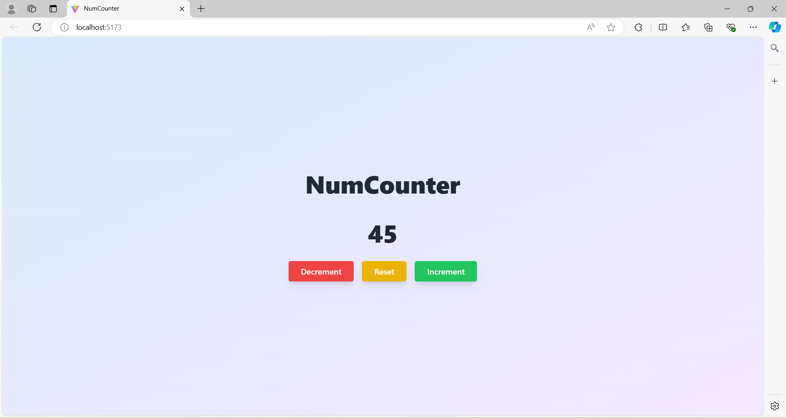

# NumCounter - Counter App

A straightforward counter application built with React.js and Tailwind CSS. It allows users to increment, decrement, and reset a numeric value, showcasing basic React functionality and responsive design.

**Live Demo -** [NumCounter](https://anandyelloju.github.io/num-counter/)

## Table of Contents

- [Screenshots](#screenshots)
- [Installation](#installation)
- [Usage](#usage)
- [Features](#features)
- [Technologies Used](#technologies-used)
- [Contributing](#contributing)
- [Credits](#credits)
- [License](#license)

## Screenshots



## Installation

To set up this project locally, follow these steps:

1. Clone the repository:
    ```bash
    git clone https://github.com/anandyelloju/num-counter.git
    ```
2. Navigate to the project directory:
    ```bash
    cd num-counter
    ```
3. Install the dependencies:
    ```bash
    npm install
    ```
4. Start the development server:
    ```bash
    npm run dev
    ```

## Usage

After installation, you can run the project locally using the development server. The app includes the following features:

- **Increment/Decrement/Reset Buttons:** Use the buttons to increase or decrease the counter value.
- **Display Area:** Shows the current value of the counter.

## Features

- **Basic Counting Functionality:** Increment and decrement the value with ease.
- **Responsive Design:** Optimized for both desktop and mobile devices.
- **Clean UI:** Simple and intuitive interface built with Tailwind CSS.

## Technologies Used

- **React.js:** JavaScript library for building user interfaces.
- **Tailwind CSS:** Utility-first CSS framework for styling.
- **Vite:** Frontend tooling for fast development.

[](https://skillicons.dev)

## Contributing

Contributions are always welcome! - If you have suggestions or improvements.
<!--
## Credits

- **React.js:** For providing a robust framework for building UI.
- **Tailwind CSS:** For a flexible and customizable styling framework.
- **Vite:** For fast and efficient development tooling.
- [Anand Yelloju](https://github.com/anandyelloju) - Project Creator

## License

This project is licensed under the [MIT License](https://choosealicense.com/licenses/mit/) - see the [LICENSE](https://github.com/your-github-username/your-repo-name/blob/main/LICENSE) file for details.
